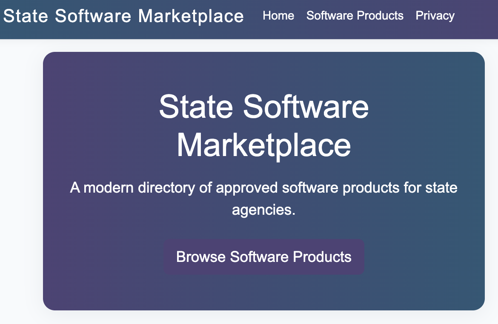

# State Software Marketplace

This is a basic CRUD web application built with ASP.NET Core MVC and Entity Framework Core, using a containerized PostgreSQL backend. The app is containerized with Docker and orchestrated with docker-compose.

## Features
- General users can search a directory of approved software products.
- Admin users can add, modify, or delete entries (no authentication for now).
- Clean, simple UI for easy customization.




## Getting Started

### Prerequisites
- [.NET 9 SDK](https://dotnet.microsoft.com/download)
- [Docker Desktop](https://www.docker.com/products/docker-desktop/)

### Running the App (Recommended: Docker Compose)
1. Build and start the containers (app, db, and migration):
   ```bash
   docker-compose up --build
   ```
   - This will build the app, start a PostgreSQL database, run EF Core migrations, and launch the web app.
2. Access the app at [http://localhost:8080](http://localhost:8080)

### Running Database Migrations (Optional)
If you need to re-run migrations (e.g., after updating models):
```bash
docker-compose run --rm migrate
```

### Stopping the App
To stop and remove containers, networks, and volumes:
```bash
docker-compose down -v
```

## Troubleshooting

If you are unable to access the app after running `docker-compose up --build`, try the following steps:

1. **Check Container Status**
   ```bash
   docker ps
   ```
   Ensure that the `app` and `db` containers are both running.

2. **Check Application Logs**
   ```bash
   docker logs state-software-marketplace-app-1 --tail 50
   ```
   Look for errors related to database connectivity or startup issues.

3. **Check Database Logs**
   ```bash
   docker logs state-software-marketplace-db-1 --tail 50
   ```
   Ensure the database is healthy and ready to accept connections.

4. **Run Database Migrations**
   If the app fails to start due to missing tables or migrations, run:
   ```bash
   docker-compose run --rm migrate
   ```
   This will apply any pending EF Core migrations to the database.

5. **Restart the App Container**
   After running migrations, restart the app container:
   ```bash
   docker restart state-software-marketplace-app-1
   ```

6. **Verify Endpoints**
   Test the main endpoints to ensure the app is running:
   ```bash
   curl -I http://localhost:8080/
   curl -I http://localhost:8080/SoftwareProducts
   curl -I http://localhost:8080/Home/Privacy
   ```
   All should return `HTTP/1.1 200 OK` if the app is healthy.

If you continue to have issues, check your Docker Desktop installation and ensure no other services are using port 8080 or 5432.

## Project Structure
- `Models/` - Entity models
- `Data/` - Database context
- `Controllers/` - MVC controllers
- `Views/` - Razor views

## Customization
- Update the UI and add authentication as needed.

---

For more details, see the comments in the code and the Copilot instructions in `.github/copilot-instructions.md`.
